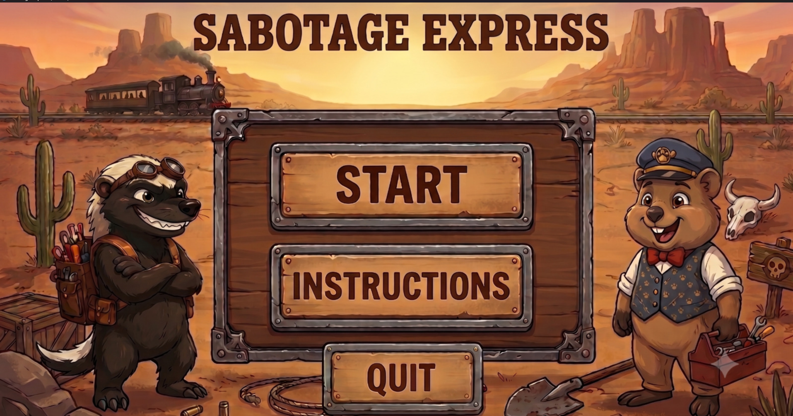
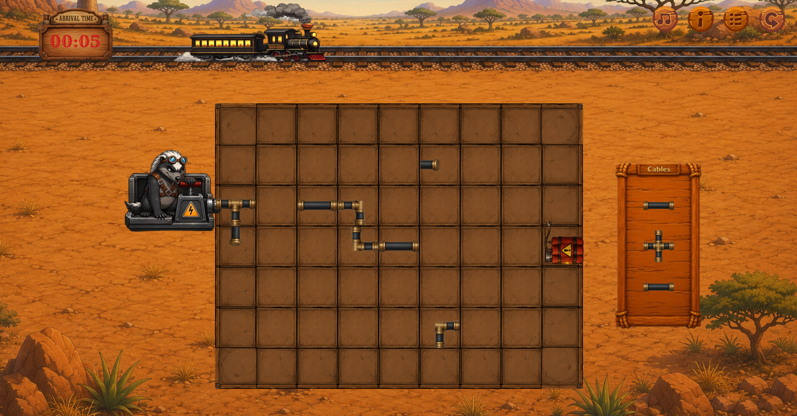
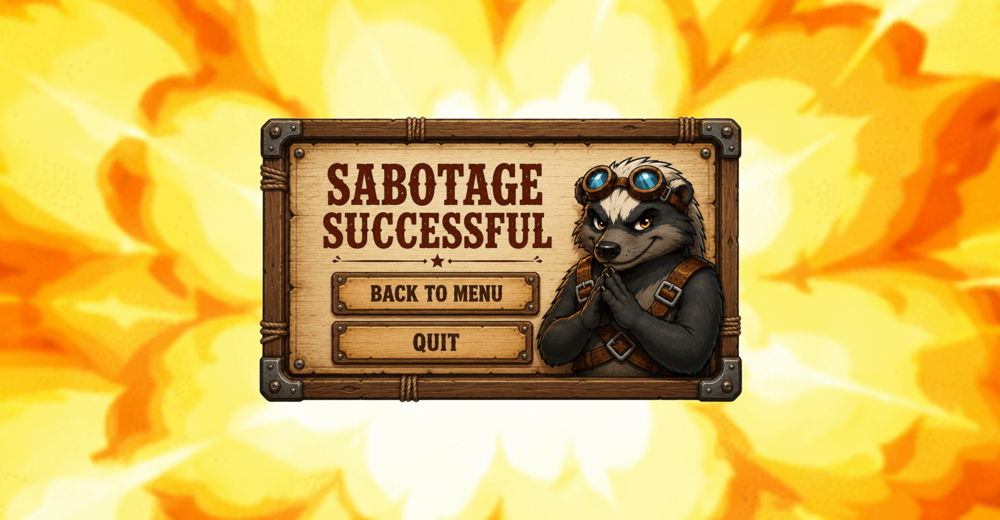
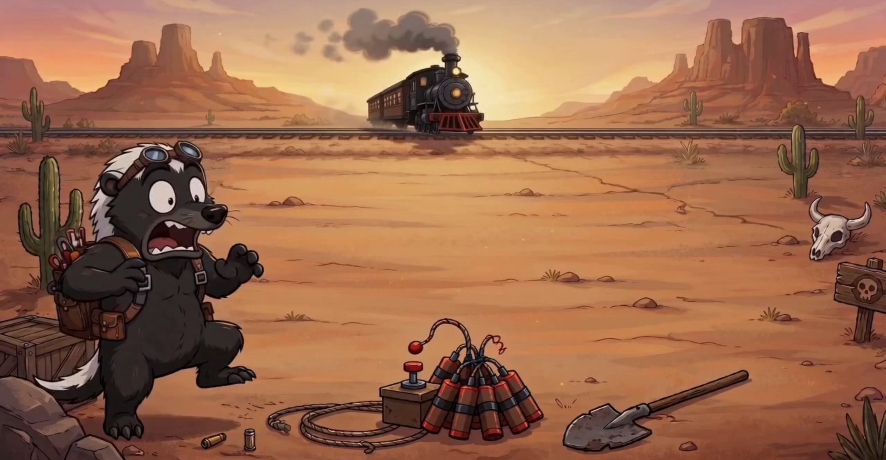

*This project has been created as part of the 42 School during the 2026 Game Jame Event by `sarfreit`, `taalmeid` and `fjose-hi`.*

# 💥 Sabotage Express 🦡

Somewhere out in the savanna, there's a train running on schedule — and inside it, a fluffy little quokka who just won't stop grinning.

Our honey badger has taken down snakes, outsmarted lions, and generally earned a reputation as the toughest creature in the bush. But this one tiny, impossibly cute quokka? Still standing. Still smiling. And the badger has *had it*.

**Sabotage Express** is a pipe-connecting puzzle game with a classic rivalry at its heart. The mission: wire up the cables, reach the dynamite, and blow the tracks before the train (and its infuriatingly adorable passenger) makes it through, so that the honey badger finally gets his revenge! 
Built from scratch in just **48 hours** during a Game Jam, one grid, one countdown, and one wounded ego at a time.

---

## 📖 About the Project

**Sabotage Express** was created at **42 Porto**, during a **Game Jam** event where participants had **48 hours** to build a game around a theme revealed at the start of the event.

The theme was:

> **"You are the villain!"**

Instead of playing the hero trying to stop a disaster, you play as the honey badger villain — routing cables across a grid to detonate dynamite and sabotage the train before it arrives.

---

## 💻 How to Install / Play

The game is playable directly in the browser (web export), as required by the Game Jam rules.

**Play online:** *[add your web build link here]*

### Alternative: Run from source in Godot

If you'd rather run the project directly from the source files:

1. Install [Godot Engine 4.7](https://godotengine.org/download) (stable).
2. Clone or download this repository.
3. Open Godot, select **Import**, and choose the `project.godot` file in the repo.
4. Press **Run** (▶) to play.

---

## 🏆 Winning & Losing

Connect a continuous path of cables from the detonator to the dynamite before the train arrives, then watch the honey badger set off the explosion.

Run out of time before completing the path, and the train arrives safely — Watch an animation of the failed sabotage.

---

## 🎨 Inspiration

Sabotage Express draws its core mechanic from **Pipe Dream**, a classic tube-connecting puzzle game — but rebuilt with a brand-new story, a villain-focused twist, and a more modern, illustrated art style.

Since the Game Jam theme was **"You are the villain!"**, we built an original concept around it: rather than being the one who saves the day, the player *is* the saboteur trying to make his evil plan succeed.

---

## 👥 Project Team

| Name | Username |
|---|---|
| Sara Fontes | `sarfreit` |
| Tainná Almeida | `taalmeid` |
| Felipe Hillebrand | `fjose-hi` |

Although work was shared across many parts of the project, the main areas of focus were:

- **Felipe** — Core game logic (cable connections, win/lose detection)
- **Sara** — UI design, animations, and general game polish
- **Tainná** — Scene/environment transitions (menu, game over, etc.) and menu graphic design

---

## ⚖️ Licenses & Credits

- All images were generated with AI (ChatGPT), based on prompts and visual concepts developed by the three of us.
- Music was also generated with AI, following the same collaborative direction.
- Animations were produced from multiple frames generated from the same base image.
- All visual and gameplay ideas were conceived by our team, even though final assets were rendered with AI assistance.

---

### 📚 Resources used

- Godot Engine official documentation
- Various Godot tutorial videos, notably from the YouTube channel **"Net Ninja"**
- AI assistance for debugging and engine-related explanations, as we were new to Godot with limited prior experience

**No copyright was infringed during the creation of this game.**

---

## 🚧 To Be Developed

- The game is built around a `level_base` scene and a JSON data file, allowing new levels — including obstacles — to be added easily. Simply instance a new level base and all values are automatically and responsively generated from the JSON.
- A level-selection menu with more complex levels.
- Improved animations with additional frames for smoother movement.
- An expanded main menu with more options and information.

---

🦡 *Made with sabotage, sarcasm, and way too much coffee during a single weekend.*